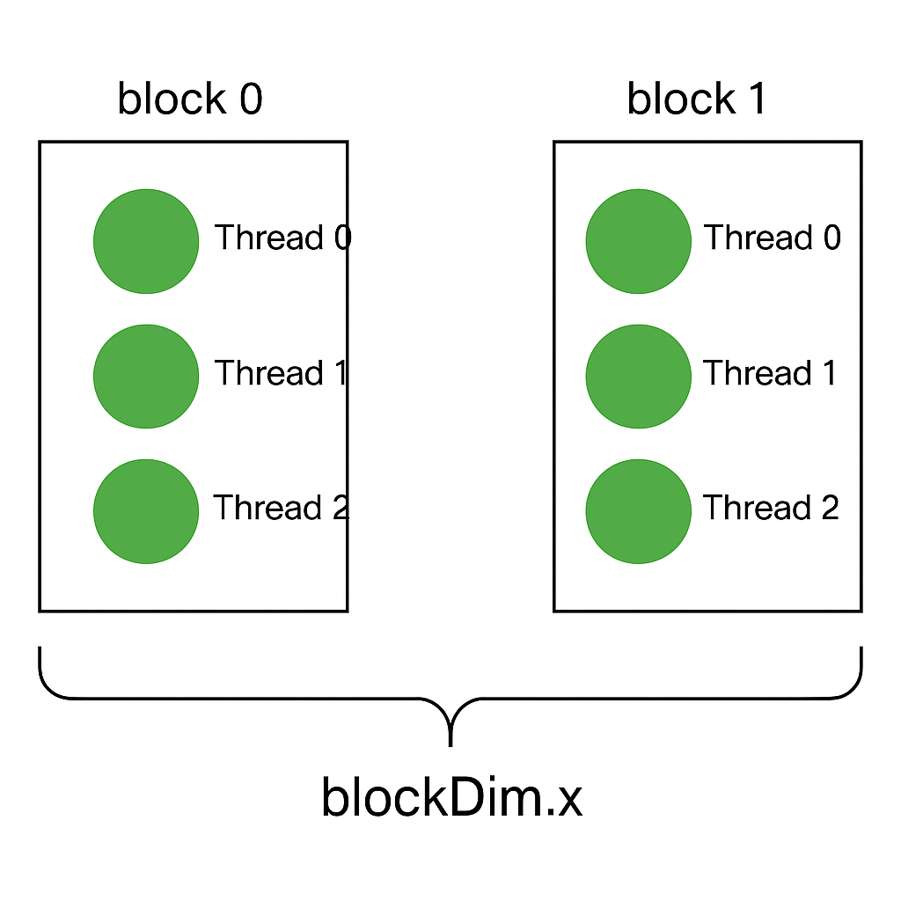

### Splitting Parallel Blocks

- Parallel in GPU: The parallel code is constructed by instructing CUDA runtime system on how many ```parallel copies``` (blocks) of our kernel to launch
- Block is splitted into threads.

## GPUs sum of a longer vector
### Challenging:
- Have to change the index compution within the kernel
- Have to change the kernel lauch itself
```int tid = threadIdx.x + blockIdx.x*blockDim.x```

## Shared memory and Synchronization
### Dot product
- Each thread multiples a pair of corresponding entries and then every thread moves on to its next pair. In details:
    Supppse that we have two vectors A and B and we want to compute the dot product and store the result in C.
    In CUDA, instead of using a sequential loop, we can use multiple parallel threads, each responsible for computing a part of the dot product.
    For instance,  
    ```c
        int A[8] = {1, 2, 3, 4, 5, 6, 7, 8};
        int B[8] = {10, 20, 30, 40, 50, 60, 70, 80};
        int C[8]; 
    ```
    We use 4 threads to process:
    - Thread 0 computes ```A[0] * B[0]``` and stores it in ```C[0]```
    - Thread 1 computes ```A[1] * B[1]``` and stores it in ```C[1]```
    - Thread 2 computes ```A[2] * B[2]``` and stores it in ```C[2]```
    - Thread 3 computes ```A[3] * B[3]``` and stores it in ```C[3]```
    After all threads have completed their computaions, each continues to com pute the next pair of entries:
    - Thread 0 computes ```A[4] * B[4]``` and stores it in ```C[4]```
    - Thread 1 computes ```A[5] * B[5]``` and stores it in ```C[5]```
    - Thread 2 computes ```A[6] * B[6]``` and stores it in ```C[6]```
    - Thread 3 computes ```A[7] * B[7]``` and stores it in ```C[7]```
    CUDA code for visualization:
    ```c
    __global__ void dotProduct(int *A, int *B, int *C)
    {
        int tid = threadIdx.x + blockIdx.x * blockDim.x;
        int stride = blockDim.x * gridDim.x;
        for (int i = tid; i < N; i += stride)
        {
            C[i] = A[i] * B[i];
        }
    }
    ```

